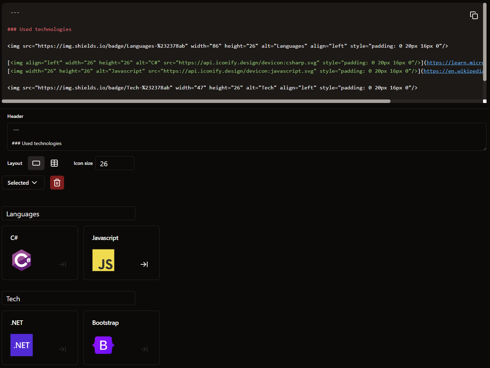

# Changelog

## v1.2.0 (2024-03-07)

## Output customization

Tech can now be split into groups and when using one of 2 layouts (or both) you can name header of these groups. Also you can edit header or icon size.

## Images tooltip

Generated markdown now shows tech name on hover as a tooltip

## v1.1.0 (2024-02-13)

## What's changed

- ✨ Add some vue-related/compatible tech icons
- 🐛 Make preview style work on picture tag

## v1.0.0 (2024-02-10)

## What's changed

- ✨ Finish minimum viable product for v1.0.0
