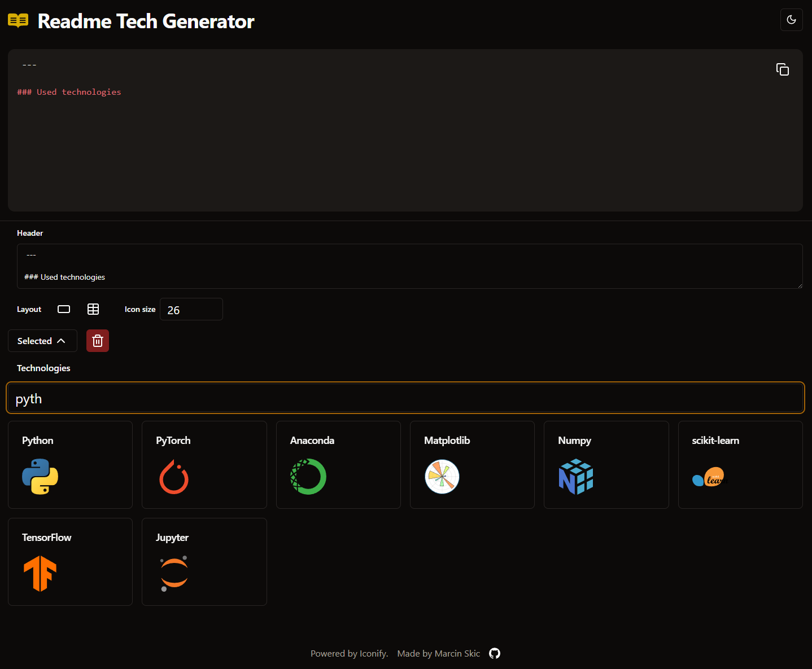
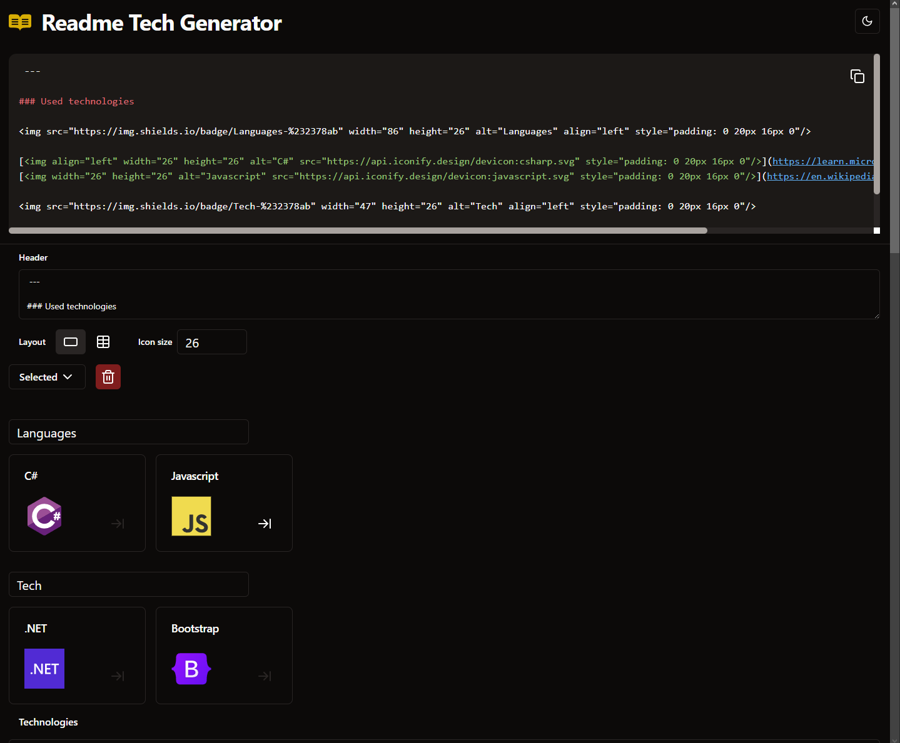

## Description

Website for generating summary of the technology used in repository, suitable for README footer. Technologies and their icons are selected subjectively for my needs. Maybe in the future, I will extend this app to allow users to search Iconify and save their collection to localStorage, but for now, this project is considered finished.

## Features

- List of selectable technologies
- Fuzzy search
- Generation of badges and table based layout
- Light and dark mode, check icons appearance
- Generated markdown supports light and dark mode by using `picture` tag

## Showcase

 

## Contributors

Thanks go to these wonderful people ([emoji key](https://allcontributors.org/docs/en/emoji-key)):

<table>
    <tbody>
        <tr>
            <td align="center" valign="top" width="14.28%"><a href="https://github.com/FilipTarajko"> <b>Filip Tarajko</b></a> <a href="https://github.com/MarcinSkic/readme-tech-generator/commits?author=FilipTarajko" title="Code">💻</a></td>
        </tr>
    </tbody>
</table>

---

### Used technologies

